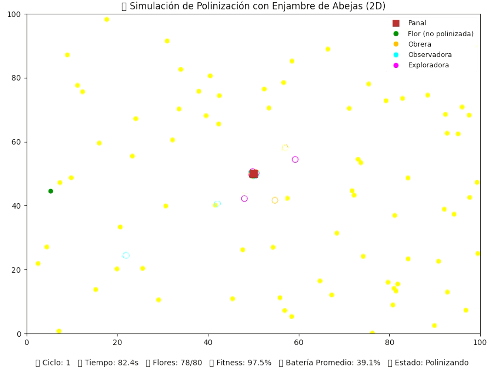

# 🚀 Simulaciones Inteligentes con Drones: Coordinación, Polinización y Rescate


Este conjunto de proyectos explora **el comportamiento colectivo de drones** aplicando **algoritmos bioinspirados**: coordinación visual en formaciones, optimización de polinización (modelo de abejas) y búsqueda eficiente en rescate (modelo ACO).

---

## 🧩 1. Formación de Drones (Coordinación Visual 2D/3D)

### 📋 Descripción
Simulación de **40 drones** que se organizan automáticamente para recrear figuras o siluetas, inspiradas en formaciones de espectáculos aéreos.  
El sistema genera los puntos de las figuras y los drones los siguen coordinadamente, ajustando posiciones y colores en tiempo real.


### ⚙️ Implementación
- Visualización 2D con proyección 3D de profundidad.
- Extracción de puntos de contorno y relleno para formar figuras.
- Movimiento suave de drones con trayectorias interpoladas.
- Cambio dinámico entre figuras en bucle infinito.
- Drones representados como puntos de color único.

### 🔄 Mejoras agregadas
- Eliminación de ruido y normalización de puntos.
- Sincronización de movimiento para mantener densidad uniforme.
- Mejora visual: transiciones suaves y escalado automático.
- Soporte para múltiples figuras con cambio automático.

### 💡 Posibles mejoras
- Incorporar comunicación entre drones (evitar colisiones).
- Control de velocidad individual según posición en la figura.
- Expansión a entornos 3D reales con obstáculos.

---

## 🐝 2. Simulación de Polinización con Enjambre de Abejas

### 📋 Descripción
Inspirado en el **Algoritmo de Enjambre de Abejas (Bee Swarm Optimization)**, este proyecto simula un invernadero donde **40 drones (abejas)** polinizan flores de manera eficiente.  
Cada abeja tiene un rol:
- **Obreras**: polinizan flores maduras.  
- **Exploradoras**: buscan nuevas flores.  
- **Observadoras**: analizan la eficiencia de las rutas.



### ⚙️ Características Principales
- Simulación 2D con un **panel informativo en tiempo real**.
- **Batería simulada**: las abejas deben regresar al panal (base central) a recargar.
- **Fitness dinámico**: maximiza la polinización total y minimiza el tiempo.
- **Color y labels** para distinguir roles.
- Reinicio automático tras completar la polinización.

### 📊 Métricas mostradas en tiempo real
- Tiempo transcurrido.
- Flores polinizadas.
- Fitness global.
- Batería promedio.
- Estado general del enjambre.

### 🔄 Mejoras realizadas
- Ajuste de velocidad y batería (15% más eficiente).
- Sistema de reinicio automático tras cobertura completa.
- Visualización limpia solo con puntos móviles.
- Actualización continua de métricas sin detener la simulación.

### 💡 Posibles mejoras futuras
- Introducir dinámica ambiental (zonas con más o menos flores).
- Comunicación cooperativa entre abejas.
- Modelos energéticos más realistas (consumo variable).
- Representación 3D del invernadero.

---

## 🧠 3. Sistema de Rescate con Drones usando Algoritmo ACO

### 📋 Descripción
Simulación de **10 drones de rescate** que colaboran mediante el **algoritmo de colonia de hormigas (ACO)** para localizar supervivientes y recursos en un área post-desastre.  
El sistema optimiza las rutas colectivas mediante feromonas digitales.


### 🤖 Algoritmo ACO Adaptado
- 10 drones (hormigas) con feromonas dinámicas.
- Fitness basado en **tiempo total de cobertura**.
- Evaporación y actualización de feromonas por iteración.
- Rutas optimizadas con probabilidad de transición.

### 🗺️ Simulación del Terreno
- Supervivientes (70%) y recursos (30%) distribuidos aleatoriamente.
- Aparición dinámica de nuevos puntos.
- Cobertura total de un área 100x100.

### 📊 Visualización
- Animación en tiempo real con rastro de feromonas.
- Paneles de métricas y cobertura.
- Representación de rutas óptimas con flechas.
- Imagen resumen generada automáticamente al final.

### 🔧 Mejoras implementadas
- Feromonas representadas como puntos discretos.
- Reducción de tamaño de elementos visuales.
- Efecto de estela para mostrar antigüedad de rutas.
- Leyenda compacta con símbolos diferenciados.

### 💡 Posibles mejoras
- Obstáculos dinámicos y condiciones meteorológicas.
- Integración de drones heterogéneos.
- Algoritmos multi-objetivo con priorización de rescate.
- Sincronización multiagente con comunicación directa.

---

## 📈 Comparativa General

| Proyecto | Algoritmo | Objetivo | N° Drones | Visualización | Interacción |
|-----------|------------|-----------|------------|----------------|--------------|
| Formación de figuras | Coordinación | Crear figuras sincronizadas | 40 | 2D/3D | Automática |
| Polinización | Bee Swarm Optimization | Maximizar polinización y eficiencia | 40 | 2D + panel dinámico | Reinicio automático |
| Rescate | Colonia de Hormigas (ACO) | Optimizar rutas de búsqueda | 10 | 2D con feromonas | Imagen resumen |

---

## 🔬 Conclusión

Estos tres ejercicios demuestran la **aplicación práctica de algoritmos bioinspirados** (formación, cooperación y optimización) en contextos de **inteligencia colectiva con drones**.  
Cada simulación incorpora visualización, métricas y mejoras progresivas, evolucionando desde la coordinación visual básica hasta la optimización adaptativa.

---

## 🛠️ Requerimientos Generales

```bash
pip install numpy matplotlib
